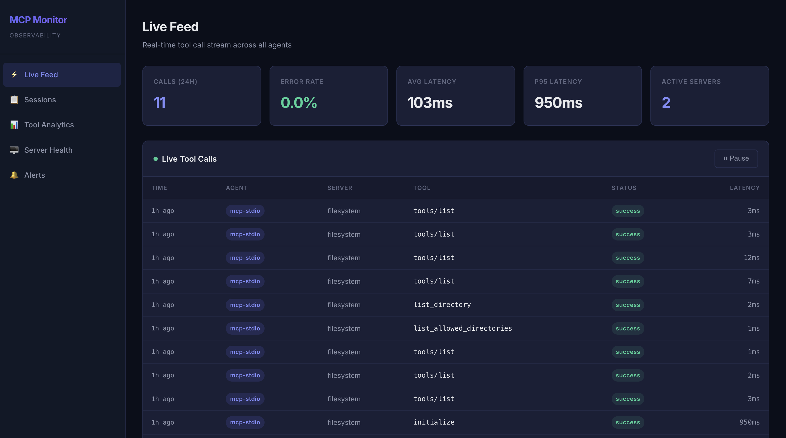

# MCP Monitor

**Transparent observability for agentic AI pipelines.**

MCP Monitor intercepts every tool call made by an AI agent — whether the agent uses the [Model Context Protocol (MCP)](https://modelcontextprotocol.io) or calls Python functions directly — and surfaces metrics, session replays, and alerts through a local web dashboard.

**Zero changes to your agent. Zero changes to your MCP servers.**



---

## Features

- ⚡ **Live Feed** — Real-time SSE-powered stream of all tool calls with status badges and latency
- 📋 **Session Replay** — Browse sessions, view call timelines with a Gantt chart, expand any call to inspect arguments and responses
- 📊 **Tool Analytics** — P50/P95/P99 latency charts, call volume, and error rate trends via Chart.js
- 🖥️ **Server Health** — Per-server status cards (healthy / degraded / down) with auto-refresh
- 🔔 **Alerts** — Configurable P95 latency and error rate thresholds with cooldown-based alerting
- 🔒 **Secret Sanitization** — Automatically redacts tokens, passwords, API keys from stored arguments
- 🐍 **Python SDK** — Zero-dependency pip package to monitor any Python agent (QwenAgent, LangChain, custom)
- 💾 **SQLite Storage** — Single-file database with WAL mode for fast concurrent reads

---

## Architecture

```
Agent (Claude, Cursor, etc.)
    │
    ├── Multiplexer mode (recommended)
    │     mcp-monitor serve
    │       ├── spawns Server A ──┐
    │       ├── spawns Server B ──┤── POST /api/ingest ──► Dashboard Server ──► SQLite
    │       └── spawns Server C ──┘         │
    │                                  EventBus.emit()
    ├── Per-server proxy mode                │
    │     mcp-monitor proxy             SSE push to
    │       └── spawns Server ──────►   Dashboard UI
    │
    └── Python SDK ──► POST /api/ingest
```

**Multiplexer mode** is the recommended approach: add one entry to your MCP config and monitor all servers. The `serve` command spawns every configured server, merges their tools, routes calls, and records everything.

**Per-server proxy mode** wraps a single server — useful when you want fine-grained control over which servers are monitored.

---

## Quick Start

### Prerequisites

- Node.js 18+
- npm

### Install & Run

```bash
git clone <repo-url> mcp-monitor
cd mcp-monitor

# Install backend dependencies
npm install

# Build the backend and the dashboard UI automatically
npm run build

# Link globally to use the 'mcp-monitor' command anywhere
npm link

# Start the dashboard server
mcp-monitor start
```

The dashboard will be available at **http://localhost:4242**.

### Send a Test Event

```bash
curl -X POST http://localhost:4242/api/ingest \
  -H 'Content-Type: application/json' \
  -d '{
    "sessionId": "test-session",
    "agentType": "python-sdk",
    "serverName": "my-server",
    "toolName": "read_file",
    "method": "read_file",
    "arguments": {"path": "/tmp/test.txt"},
    "response": null,
    "status": "success",
    "latencyMs": 150,
    "timestamp": "2026-03-09T10:00:00Z"
  }'
```

---

## Connecting Agents

### Multiplexer Mode

Monitor **all** MCP servers with a single config entry. No need to wrap each server individually.

**Step 1.** List your servers in `mcp-monitor.config.json`:

```json
{
  "servers": [
    { "name": "filesystem", "transport": "stdio", "command": "npx @modelcontextprotocol/server-filesystem /tmp" },
    { "name": "github", "transport": "stdio", "command": "npx @modelcontextprotocol/server-github", "env": { "GITHUB_TOKEN": "$GITHUB_TOKEN" } }
  ],
  "dashboard": { "port": 4242 }
}
```

**Step 2.** Replace all MCP server entries in your agent config with one:

```json
{
  "mcpServers": {
    "mcp-monitor": {
      "command": "mcp-monitor",
      "args": ["serve", "-c", "/absolute/path/to/mcp-monitor.config.json"]
    }
  }
}
```

**Step 3.** Start the dashboard server separately:

```bash
mcp-monitor start
```

The agent sees one MCP server with all tools combined. MCP Monitor spawns each real server internally, routes every `tools/call` to the correct child, and records the call.

> **Note on Tool Names**: To prevent naming collisions between different MCP servers that happen to expose identical tools, the Multiplexer prefixes all tool names with their originating server's name. For example, if your `filesystem` server has a tool named `read_file`, the LLM will see it exposed as `filesystem_read_file`.

### Per-Server Proxy Mode

Alternatively, wrap individual servers by replacing their command:

```json
{
  "mcpServers": {
    "filesystem": {
      "command": "mcp-monitor",
      "args": ["proxy", "--name", "filesystem",
               "--cmd", "npx @modelcontextprotocol/server-filesystem /tmp"]
    }
  }
}
```

### Python Agent (QwenAgent)

```python
from agent_monitor import patch_qwen_agent

patch_qwen_agent(server_name="my-agent")  # call once before creating agent
# rest of agent code unchanged
```

### Generic Python Tool

```python
from agent_monitor import monitor

@monitor(server_name="my-tools")
def query_database(sql: str) -> dict:
    ...
```

### Python SDK Installation

```bash
cd sdk/python
pip install -e .
```

The SDK has **zero external dependencies** — it uses only Python stdlib (`urllib`, `threading`, `json`).

---

## Configuration

Create `mcp-monitor.config.json` in the project root:

```json
{
  "servers": [
    {
      "name": "filesystem",
      "transport": "stdio",
      "command": "npx @modelcontextprotocol/server-filesystem /tmp"
    },
    {
      "name": "github",
      "transport": "stdio",
      "command": "npx @modelcontextprotocol/server-github",
      "env": { "GITHUB_TOKEN": "$GITHUB_TOKEN" }
    },
    {
      "name": "remote-tools",
      "transport": "http",
      "targetUrl": "https://my-mcp-server.com",
      "listenPort": 4243
    }
  ],
  "dashboard": {
    "port": 4242
  },
  "alerts": {
    "latencyP95Ms": 2000,
    "errorRatePercent": 10,
    "cooldownMinutes": 5
  }
}
```

Environment variable substitution is supported in `env` fields — `$VAR_NAME` is replaced with `process.env.VAR_NAME`.

---

## CLI Commands

```bash
# Start dashboard server + alert engine
mcp-monitor start [-c path/to/config.json]

# Run as a multiplexing MCP server (add as single entry in agent config)
mcp-monitor serve [-c path/to/config.json] [--dashboard-url http://localhost:4242]

# Start a single MCP proxy (wrap one server)
mcp-monitor proxy --name filesystem --cmd "npx @modelcontextprotocol/server-filesystem /tmp"

# List recent sessions
mcp-monitor sessions [--limit 20]

# Replay a session's tool calls
mcp-monitor replay <session-id>

# Show per-tool stats
mcp-monitor stats [--sort latency_p95|error_rate|call_count] [--since 1h|6h|24h|7d]

# Export data
mcp-monitor export [--format json|csv] [--since 24h] [--output file.json]
```

---

## REST API

| Endpoint | Description |
|---|---|
| `GET /api/overview` | Aggregated stats: total calls, error rate, avg/p95 latency, recent calls |
| `GET /api/sessions` | Paginated session list with call counts (`?limit=20&offset=0`) |
| `GET /api/sessions/:id/calls` | All tool calls for a session in chronological order |
| `GET /api/tools/stats` | Per-tool latency percentiles and error rates (`?since=24h`) |
| `GET /api/servers` | Server health status derived from last 5 minutes of data |
| `GET /api/alerts` | Fired alert history (`?limit=50&offset=0`) |
| `GET /api/stream` | SSE endpoint — pushes `tool_call` and `alert` events in real time |
| `POST /api/ingest` | Accepts `CollectorEvent` JSON (used by Python SDK) |

---

## Project Structure

```
mcp-monitor/
├── src/
│   ├── types.ts                          # All shared TypeScript interfaces
│   ├── config.ts                         # Config loader with env var substitution
│   ├── cli.ts                            # Commander.js entry point
│   ├── core/
│   │   ├── Store.ts                      # SQLite (better-sqlite3) CRUD
│   │   ├── Collector.ts                  # Sanitize → truncate → persist → emit
│   │   ├── RemoteCollector.ts           # HTTP POST to dashboard /api/ingest
│   │   ├── SessionManager.ts            # Session lifecycle + idle timeout
│   │   ├── EventBus.ts                  # Node.js EventEmitter singleton
│   │   └── AlertEngine.ts              # P95 latency & error rate monitoring
│   ├── ingestion/
│   │   ├── mcp/
│   │   │   ├── MuxServer.ts             # Multiplexing MCP server (aggregates all servers)
│   │   │   ├── ProtocolInterceptor.ts   # JSON-RPC request/response matching
│   │   │   ├── StdioProxy.ts            # MCP stdio transport proxy
│   │   │   └── HttpProxy.ts            # MCP HTTP reverse proxy
│   │   └── IngestEndpoint.ts            # POST /api/ingest handler
│   └── dashboard/
│       ├── server.ts                     # Express + SSE + static serving
│       ├── routes/                       # API route handlers
│       └── ui/                           # React + Vite dashboard
│           └── src/pages/
│               ├── LiveFeed.tsx
│               ├── SessionReplay.tsx
│               ├── ToolAnalytics.tsx
│               ├── ServerHealth.tsx
│               └── Alerts.tsx
├── sdk/python/
│   ├── pyproject.toml
│   └── agent_monitor/
│       ├── __init__.py
│       ├── collector.py                  # Fire-and-forget POST to /api/ingest
│       └── decorators.py                # patch_qwen_agent() + @monitor
├── mcp-monitor.config.json
├── package.json
└── tsconfig.json
```

---

## Tech Stack

| Layer | Technology |
|---|---|
| MCP Proxy | TypeScript (child_process, JSON-RPC parsing) |
| Core | TypeScript + Express 5 |
| Database | SQLite via `better-sqlite3` (WAL mode) |
| Dashboard UI | React 19 + Vite + Chart.js |
| Real-time Push | Server-Sent Events (SSE) |
| Python SDK | Python 3.9+ (stdlib only) |
| CLI | Commander.js |

---

## Session Management

Sessions are created and managed automatically:

- **MCP connections:** A new session starts on every `initialize` JSON-RPC message
- **Idle timeout:** If 5+ minutes pass between tool calls, a new session is created
- **Explicit session ID:** Set `MCP_MONITOR_SESSION_ID` env var for deterministic session grouping
- **Python SDK:** Each Python process gets a unique UUID session, or set `AGENT_MONITOR_SESSION_ID`
- **Session end:** Marked when the proxied process exits or the connection closes

---

## Alert System

The AlertEngine is fully event-driven — **no polling**. It listens to every `tool_call` event from the EventBus and evaluates thresholds in real time:

- **P95 Latency** per tool → fires if above `latencyP95Ms` threshold
- **Error Rate** per tool → fires if above `errorRatePercent` threshold (requires ≥5 calls)

Cooldown logic prevents the same alert from re-firing within `cooldownMinutes` (default: 5 min). Alerts are persisted to SQLite and pushed to the dashboard via SSE.

---

## License

MIT
